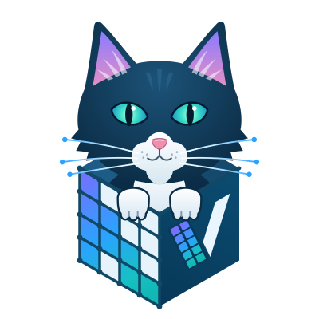

<div align="center">



# Veda Sparse Attention for ComfyUI (MiniMax-H3)

**Faster MiniMax-H3 video + audio generation in ComfyUI, with your usual
workflow, LoRAs and checkpoints.** [中文说明](README.zh-CN.md)

</div>

[Veda](https://arxiv.org/abs/2605.30325) (ICML 2026) trains a small
predictor that finds the ~10% of attention that matters and skips the rest.
This custom node plugs it into ComfyUI's native MiniMax-H3 (T2VA, FL2VA and
R2VA) as one node: **MODEL in, MODEL out**.

* **Faster where it hurts:** long clips spend most of their time in
  attention; Veda reports 2-3x end to end on 10-14 s clips (more on longer,
  less on short ones).
* **Nothing else changes:** weights are untouched, so Turbo / style LoRAs,
  fine-tuned or quantized H3 checkpoints, first/last-frame and reference
  conditioning, and other attention or block patches keep working.
* **Safe by default:** every kernel passes a self-test on your GPU before
  it is used; anything Veda cannot handle runs normal attention and says so
  on the node, never a broken render.

## Quick start

1. **Install** with ComfyUI Manager (search "Veda") or
   `comfy node install veda-sparse-attention`, or clone this repo into
   `ComfyUI/custom_nodes/`. Restart ComfyUI. Needs ComfyUI >= 0.38.0.
2. **Open a template:** *Workflow -> Browse Templates -> Veda-on-ComfyUI*:
   "Veda MiniMax H3 T2VA" or "Veda MiniMax H3 R2VA". Missing models can be
   downloaded from the dialog that pops up.
3. **Write your prompt and run.** The first run downloads the predictor
   (~275 MB, into `models/veda`) and compiles the kernels once.

To add Veda to your own H3 workflow: put **Veda Sparse Attention (MiniMax
H3)** after the model loader and LoRA loaders, right before the guider /
sampler. To compare, select it and press **Ctrl+B** (bypass): same seed,
full attention.

### Fastest kernels (optional, once)

| Your machine | Run (in `custom_nodes/Veda-on-ComfyUI`) | Kernel |
|---|---|---|
| NVIDIA, Windows (portable / Desktop) | double-click `install_fa4.bat` | FlashAttention-4 |
| NVIDIA, Linux (incl. DGX Spark) | `./install_fa4.sh` | FlashAttention-4 |
| Apple silicon | `./install_fa4.sh` (installs MLX) | MLX |

Without them Veda still works with portable kernels (FlexAttention or torch).
The scripts never touch your torch install and end with a self-test that
prints which kernel each GPU will use.

## What the node shows

The text on the node tells you what is happening, e.g.

```
Ready · RTX 4090 (sm89) · kernel fa4-sm89 · current 90% sparse · history 90% sparse
⚡ Veda on fa4-sm89 · 1344x768, 37 latent frames · trained plan 16x9_t37 · ...
✅ Veda last run: 800 sparse / 0 full-attention calls · kept 10.0% of video key tiles · fa4-sm89
```

A ⚠ line means Veda fell back or is outside what it was trained on (an
unusual size, a missing kernel), with the reason.

## Settings

Only `model` and `predictor` are visible; everything else is an advanced
input (click "show advanced inputs") with the trained defaults:

| Input | Default | Meaning |
|---|---|---|
| `current_sparsity` / `current_tiles` | 90 % / 0 | Key tiles of the generated video each query tile skips; `tiles > 0` keeps exactly that many 128-token tiles instead. |
| `history_sparsity` / `history_tiles` | 90 % / 0 | The same for conditions: first/last frames, guide frames, reference images and videos. 0 % = conditions use full attention. |
| `full_attention_layers` | empty | 0-based DiT blocks that keep full attention, e.g. `0, 1, 47-49`. |
| `full_attention_steps` | empty | 0-based sampling steps that keep full attention, e.g. `0`. |
| `backend` | auto | `fa4`, `flex`, `torch`, `mlx`; auto takes the fastest that passes its self-test. |
| `untrained_size` | sparse | For sizes without a trained plan: nearest plan, or full attention. |

The released predictor was trained for **1344x768, 768x1344, 768x768 and
1024x768 at 5 / 10 / 14 s** with the 8-step Turbo LoRA. Other sizes, step
counts and R2VA / FL2VA conditions work but are outside its training data;
check the result against full attention (bypass).

## Hardware

| Hardware | Kernel | Status |
|---|---|---|
| RTX 30 / A100 / RTX 40 / L40 (sm80-89) | fa4-sm80 (patched FA4) | see [docs/hardware.md](docs/hardware.md) |
| H100 / H200 (sm90) | fa4-sm90 | see [docs/hardware.md](docs/hardware.md) |
| B200 / B300 (sm100 / sm103) | fa4-sm100 | see [docs/hardware.md](docs/hardware.md) |
| RTX 50, RTX PRO 6000 Blackwell (sm120) | fa4-sm120 | see [docs/hardware.md](docs/hardware.md) |
| DGX Spark / GB10 (sm121) | fa4-sm120 | see [docs/hardware.md](docs/hardware.md) |
| Apple silicon (M series) | mlx / torch | tested (M3 Pro) |
| any other NVIDIA GPU | flex / torch | portable |

Windows and Linux are both supported; the FA4 copy shipped here is patched
to import on Windows.

## FAQ

* **Does it change my LoRA's style?** No. Veda only decides which attention
  blocks to compute; the model weights (and your LoRAs) are untouched.
* **Can I use it with other attention nodes?** Calls Veda declines go to
  whatever attention override was set before it. Do not combine it with
  ComfyUI's own "Model Sparse Attention" node on H3 (the node warns).
* **Behind a firewall / in mainland China?** Set `HF_ENDPOINT` (for example
  `https://hf-mirror.com`) before starting ComfyUI, or download the
  predictor by hand into `models/veda`.
* **Batch size?** MiniMax-H3 itself runs batch size 1.

## Links and license

* Paper: [Veda: Scalable Video Diffusion via Distilled Sparse Attention](https://arxiv.org/abs/2605.30325) · project page: <https://veda-sparse.github.io/>
* Predictor: [Veda-Sparse/Minimax-H3-T2VA-Veda-8NFE-600Step-Preview](https://huggingface.co/Veda-Sparse/Minimax-H3-T2VA-Veda-8NFE-600Step-Preview) (MiniMax H3 Community License)
* Training code: [veda-sparse/Miowtion](https://github.com/veda-sparse/Miowtion)

Code: MIT. Bundled FlashAttention-4: BSD-3-Clause. See [NOTICE.md](NOTICE.md).
